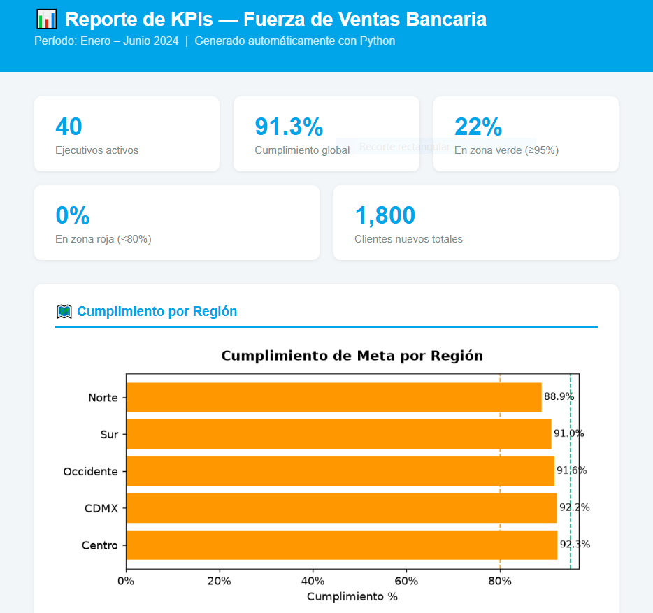
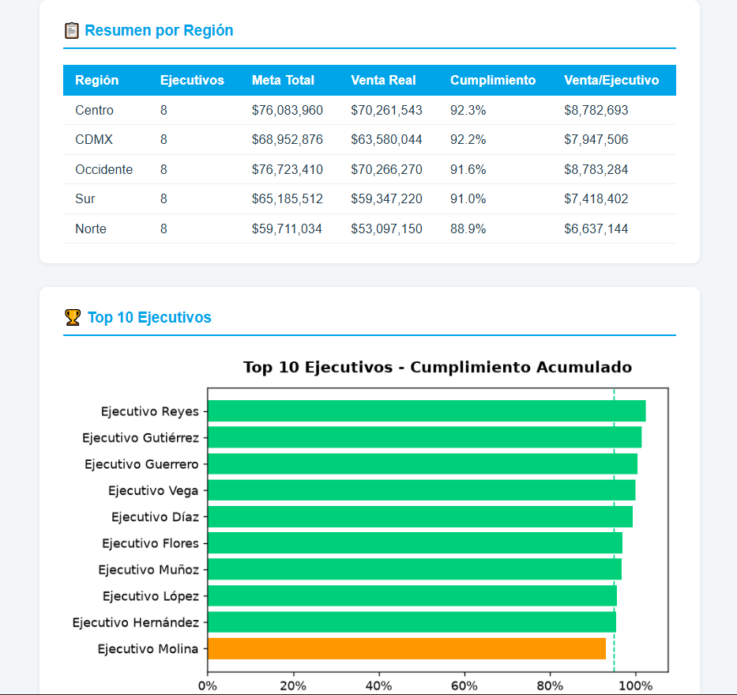

# 📊 Dashboard de KPIs — Fuerza de Ventas Bancaria

Pipeline automatizado de análisis y reporte para seguimiento de KPIs
comerciales de una fuerza de ventas bancaria. Genera un reporte HTML
ejecutivo de forma automática, listo para distribuir.

## ¿Qué hace?

- Simula datos mensuales de 40 ejecutivos comerciales en 5 regiones
- Calcula KPIs de cumplimiento, ranking y semáforo de desempeño
- Analiza capilaridad y productividad por región
- Genera un reporte HTML visual con gráficas y tablas ejecutivas

## Stack

Python · Pandas · NumPy · Matplotlib · Jinja2

## Estructura del proyecto

```
kpi-fuerza-ventas/
├── data/               # datos de entrada (CSV)
├── src/
│   ├── generar_datos.py    # simulación de datos de ventas
│   ├── calcular_kpis.py    # lógica de KPIs y métricas
│   └── generar_reporte.py  # generación del reporte HTML
├── output/             # reporte HTML generado
└── requirements.txt
```

## Cómo correr

```bash
# 1. Instalar dependencias
pip install -r requirements.txt

# 2. Generar datos
python src/generar_datos.py

# 3. Generar reporte
python src/generar_reporte.py
```

El reporte queda en `output/reporte_kpis.html`.
Ábrelo en cualquier navegador.

## Contexto de negocio

Proyecto orientado a control de gestión bancaria. Los KPIs incluyen:
cumplimiento de meta mensual, ranking por región, semáforo de desempeño
(verde ≥95%, amarillo ≥80%, rojo <80%) y análisis de productividad
por ejecutivo y zona geográfica.

## Vista previa



